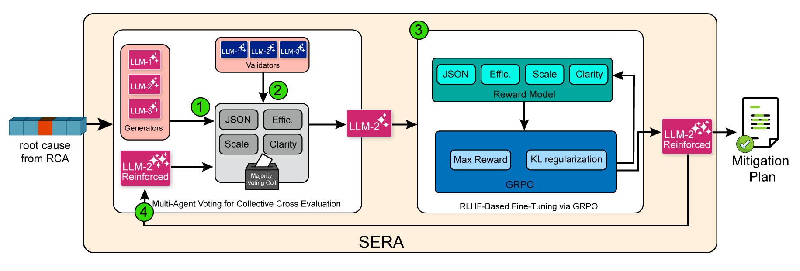

# SERA: Structured Evaluation and Reinforcement Alignment for LLMs in Microservice Mitigation

forked from https://github.com/phamquiluan/RCAEval

SERA integrates **multi-agent majority voting** with **reinforcement learning using GRPO**. Multiple LLMs act as evaluators to identify the most reliable mitigation generator, while iterative reinforcement alignment refines the generator under controlled training conditions.  

The framework systematically explores key training parameters, including:

- **Training epochs**
- **Sampling temperature**
- **Optimization algorithms**

This structured exploration enables **fair, scalable, and reproducible comparison** of LLM configurations.

## Evaluation

SERA is evaluated on **realistic microservice failure scenarios**, where LLMs are tasked with generating mitigation strategies from system logs and detected root causes. The evaluation framework measures both **quality** and **consistency** of generated mitigation plans.

Key findings include:

- **Structured multi-agent evaluation** reliably identifies the most effective mitigation generators.
- **Reinforcement alignment** improves the operational validity and consistency of generated mitigation strategies.
- The framework enables **systematic comparison of training configurations**, making it possible to determine which combinations of epochs, temperature, and optimizers yield the best performance.

## Extensibility

SERA is designed as a **modular evaluation and alignment framework**. Beyond the parameters explored in this work, it can be extended to study:

- **Learning rate variations**
- **Alternative reward functions**
- **Different pretrained LLMs for fine-tuning**

This flexibility makes SERA suitable for broader research on **LLM evaluation, alignment, and reliability in operational systems**.

## Practical Implications

SERA demonstrates that **structured multi-agent evaluation combined with reinforcement alignment** provides a practical paradigm for refining LLMs in complex operational environments. By enabling systematic experimentation and scalable evaluation, the framework supports the development of **high-quality, actionable mitigation strategies** for microservice systems.

The framework is **open sourced** to facilitate further research on reliable LLM evaluation and alignment.

<p align="center">

</p>

## Prerequisites

Experiments are run on a Linux workstation with an Intel i9-10900K CPU (20 cores, 3.70GHz), 32 GB RAM,
and a single NVIDIA RTX 3070 GPU (8 GB), using Python 3.10.12, PyTorch 2.7.1+cu126, and PyTorch
Geometric 2.6.1.


## Installation (to run BARO)

The `default` environment, used by most methods, can be installed quickly and easily. For **detailed installation instructions** for all methods, please refer to SETUP.md in the [RCAEval repository](https://github.com/phamquiluan/RCAEval/blob/main/docs/SETUP.md).


Open your terminal and run the following commands

```bash
sudo apt update -y
sudo apt install -y build-essential \
  libxml2 libxml2-dev zlib1g-dev \
  python3-tk graphviz
```

Clone SERA from GitHub


Create virtual environment with Python 3.12 (refer [SETUP.md](docs/SETUP.md) to see how to install Python3.12 on Linux)

```bash
python3.12 -m venv env
. env/bin/activate
```

Run RQ1.sh for the evaluation of the ensemble methods of SERA on the RE2-SS dataset.

```bash
.\RQ1.sh
```

Run `RQ2_RQ3.sh` to execute the full evaluation of **SERA** across all datasets.

Before running the script, you must update `create_plans.py` and `evaluation.py` to load the appropriate trained models for both plan generation and evaluation.  

Relevant sections in the code are marked with `# NOTE` comments to guide the required modifications.

For **RQ3**, select the generator obtained from one of your trained model configurations and compare its generated outputs with those produced by an open-source baseline model.

```bash
.\RQ2_RQ3.sh
```

Expected output would be saved in .csv files for each experiment, and the generated plans would be saved in .json files. You can also check the output directory for the root causes obtained by BARO for each dataset.

## Datasets

SERA is evaluated on five real-world datasets collected from three production microservices (Online Boutique, Sock Shop, and Train Ticket) . For 
Online Boutique and Sock Shop, we use the 2 datasets (RE1 and RE2) that was collected from RCAEval benchmark. The statistics of the datasets are presented in the Table below.

Table: Summary of RE1 and RE2 datasets used in microservice maintenance experiments
The *Fault Types* column indicates the number of distinct fault types (cpu, mem, disk, delay, loss, socket).  
*Metrics* shows the number of monitored metrics per dataset.

| Dataset | System | Cases | Fault Types | Metrics | Logs | Traces |
|--------|--------|------|-------------|--------|------|--------|
| RE1-OB | OB | 125 | 5 | 49–59 | N/A | N/A |
| RE1-SS | SS | 125 | 5 | 57–63 | N/A | N/A |
| RE1-TT | TT | 125 | 5 | 198–238 | N/A | N/A |
| RE2-OB | OB | 90 | 6 | 69–77 | Yes | Yes |
| RE2-SS | SS | 90 | 6 | 74–82 | Yes | Yes |
| RE2-TT | TT | 90 | 6 | 340–376 | Yes | Yes |

The datasets and their description are publicly available in Zenodo repository with the following information:
- Dataset DOI: https://doi.org/10.5281/zenodo.14590730
- Dataset URL: [https://zenodo.org/records/14590730](https://zenodo.org/records/14590730)

## Licensing

This repository includes code from various sources with different licenses. We have included their corresponding LICENSE into the [LICENSES](LICENSES) directory:

- **RCAEval**: Licensed under the [MIT License](LICENSE). Original source: This repository. [RCAEval GitHub Repository](https://github.com/phamquiluan/RCAEval/blob/main/LICENSE).
- **BARO**: Licensed under the [MIT License](LICENSES/LICENSE-BARO). Original source: [BARO GitHub Repository](https://github.com/phamquiluan/baro/blob/main/LICENSE).
- **CausalRCA**: No License. Original source: [CausalRCA GitHub Repository](https://github.com/AXinx/CausalRCA_code).
- **CIRCA**: Licensed under the [BSD 3-Clause License](LICENSES/LICENSE-CIRCA). Original source: [CIRCA GitHub Repository](https://github.com/NetManAIOps/CIRCA/blob/master/LICENSE).
- **E-Diagnosis**: Licensed under the [BSD 3-Clause License](LICENSES/LICENSE-E-Diagnosis). Original source: [PyRCA GitHub Repository](https://github.com/salesforce/PyRCA/blob/main/LICENSE).
- **MicroCause**: Licensed under the [Apache License 2.0](LICENSES/LICENSE-MicroCause). Original source: [MicroCause GitHub Repository](https://github.com/PanYicheng/dycause_rca/blob/main/LICENSE).
- **RCD**: Licensed under the [MIT License](LICENSES/LICENSE-RCD). Original source: [RCD GitHub Repository](https://github.com/azamikram/rcd).
- **RUN**: No License. Original source: [RUN GitHub Repository](https://github.com/zmlin1998/RUN).


**For the code implemented by us, we distribute them under the MIT LICENSE**.
